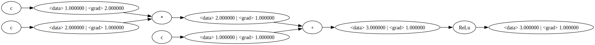
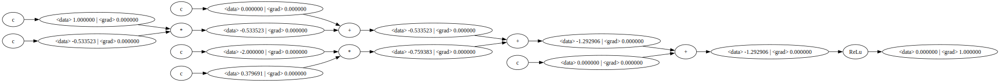
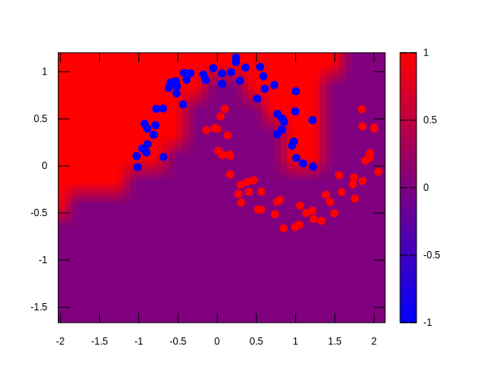
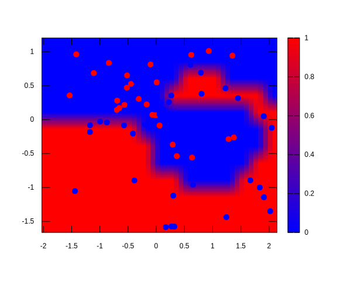
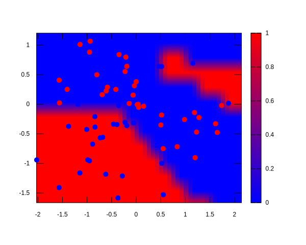
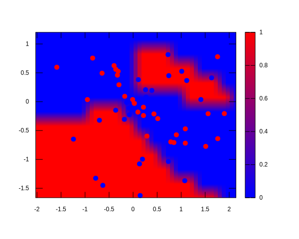

# micrograd c++

c++ version of the famous [micrograd](https://github.com/karpathy/micrograd) implementaton in python, by Andrej Karpathy

the trace_graph and sanity tests can be in tests.hpp
the neural net is in microgradc++.cpp 

### Installation

sudo apt install gnuplot
sudo apt-get install graphviz libgraphviz-dev
mkdir build
cd build
cmake ..
make

cd microgradc++
./microgradc++

you might have to modify CMakeLists.txt to get to the needed header files/libraries for graphviz

### Tracing / visualization

```cpp
auto x = Value(1.0);
auto y = (x * 2 + 1).relu();
y.backward();
dot(y.data.get(), "svg", "LR", "dot1.svg");
```



```cpp
auto n = Neuron(2);
vector<Value> x{ Value(1.0), Value(-2.0) };
auto y = n(x);
y.backward();
dot(y.data.get(), "svg", "LR", "dot2.svg");
```



### Training a neural net, sample results

```cpp
vector<int> layers{ 16, 16, 1 };
// 2 - layer neural network
auto model = MLP(2, layers);
```





